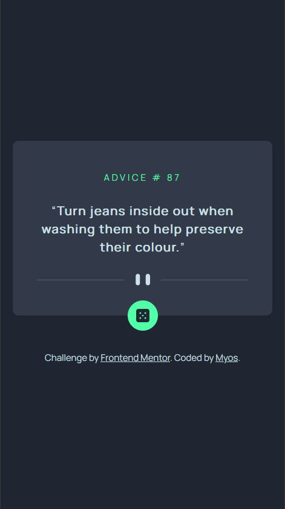

# Frontend Mentor - Advice generator app solution

This is a solution to the [Advice generator app challenge on Frontend Mentor](https://www.frontendmentor.io/challenges/advice-generator-app-QdUG-13db). Frontend Mentor challenges help you improve your coding skills by building realistic projects.

## Table of contents

- [Frontend Mentor - Advice generator app solution](#frontend-mentor---advice-generator-app-solution)
  - [Table of contents](#table-of-contents)
  - [Overview](#overview)
    - [The challenge](#the-challenge)
    - [Screenshot](#screenshot)
    - [Links](#links)
  - [My process](#my-process)
    - [Built with](#built-with)
    - [What I learned](#what-i-learned)
    - [Useful resources](#useful-resources)
  - [Author](#author)

## Overview

### The challenge

Users should be able to:

- View the optimal layout for the app depending on their device's screen size
- See hover states for all interactive elements on the page
- Generate a new piece of advice by clicking the dice icon

### Screenshot

|                Desktop                |               Mobile                |           When hovering           |
| :-----------------------------------: | :---------------------------------: | :-------------------------------: |
|  |  |  |

### Links

- Solution URL: [https://github.com/Myoschen/fm-advice-generator-app](https://github.com/Myoschen/fm-advice-generator-app)
- Live Site URL: [https://fm-advice-generator-app-delta.vercel.app/](https://fm-advice-generator-app-delta.vercel.app/)

## My process

### Built with

- [React](https://reactjs.org/)
- [Vite](https://vitejs.dev/)
- [Tailwind CSS](https://tailwindcss.com/)
- [axios](https://github.com/axios/axios)
- [react hot toast](https://react-hot-toast.com/)

### What I learned

- Use svg in React.

```tsx
import example from './example.svg';

export default function Component() {
  return 
}
```

- Prevent browser caching responses

```tsx
const fetchData = async () => {
  try {
    const { data } = await axios.get<ResponseType>(
      'https://api.example.com/',
      {
        // set a random param to prevent browser caching
        params: {
          t: new Date().getTime(),
        },
        headers: {
          Accept: 'application/json',
        },
      }
    );
    return data
  } catch (error) {
    if (axios.isAxiosError(error)) {
      return error.message;
    } else {
      return 'An unexpected error occurred';
    }
  }
};
```

### Useful resources

- [React SVG: How to use SVGs best in React](https://www.copycat.dev/blog/react-svg/) - learn how to use SVGs in react
- [quotes](https://css-tricks.com/almanac/properties/q/quotes/) - learn how to set quotes using the 'before' or 'after' pseudo-elements
- [Using JavaScript Axios/Fetch. Can you disable browser cache?](https://stackoverflow.com/questions/49263559/using-javascript-axios-fetch-can-you-disable-browser-cache) - learn how to prevent browser caching

## Author

- Website - [Myoschen](https://github.com/Myoschen)
- Frontend Mentor - [@Myoschen](https://www.frontendmentor.io/profile/Myoschen)
